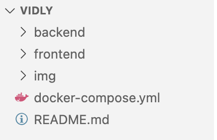
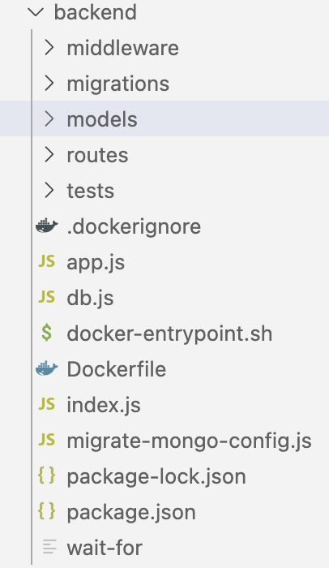
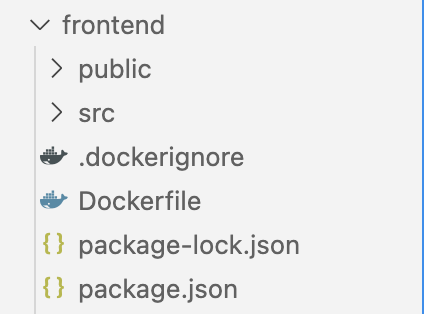
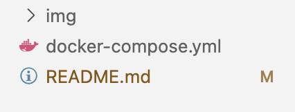
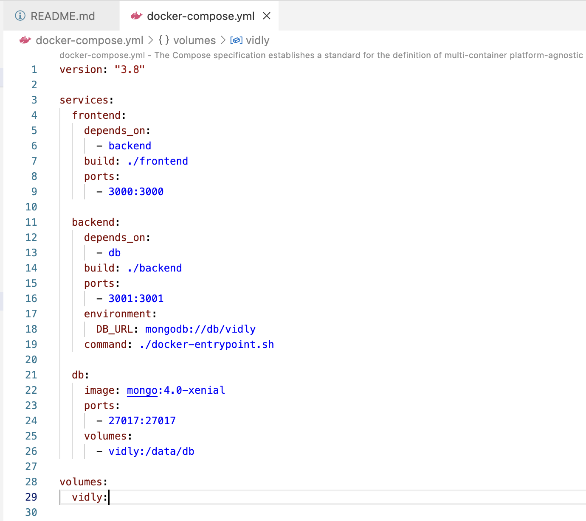
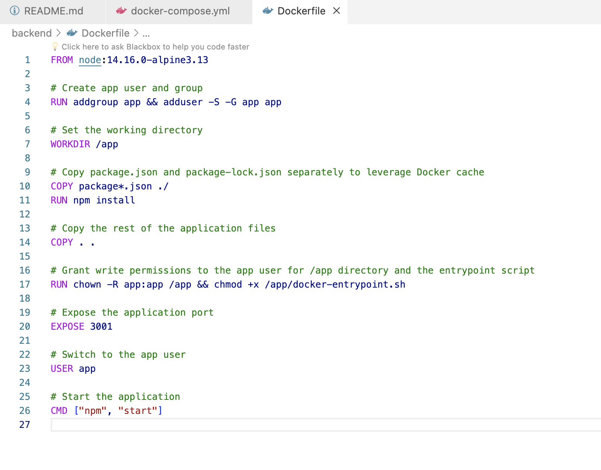
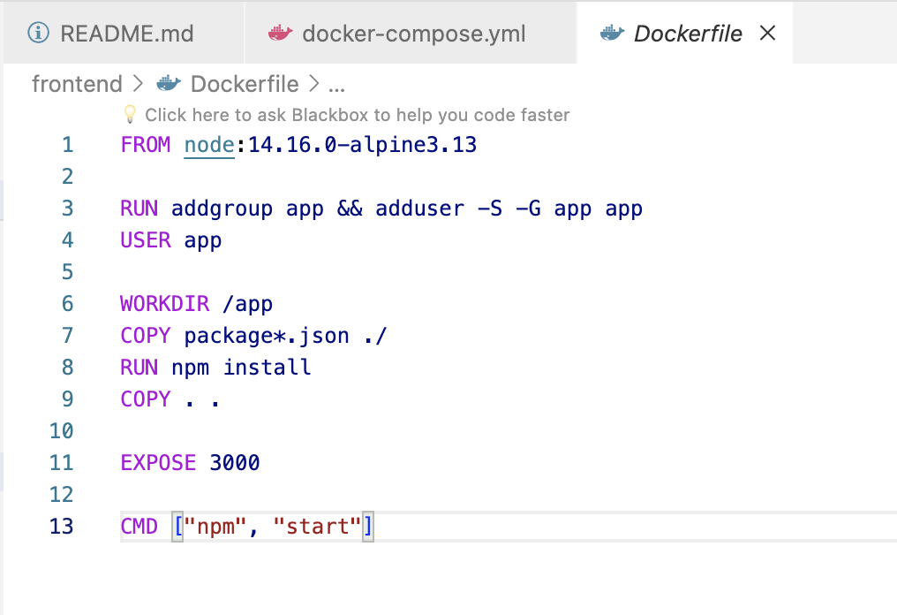
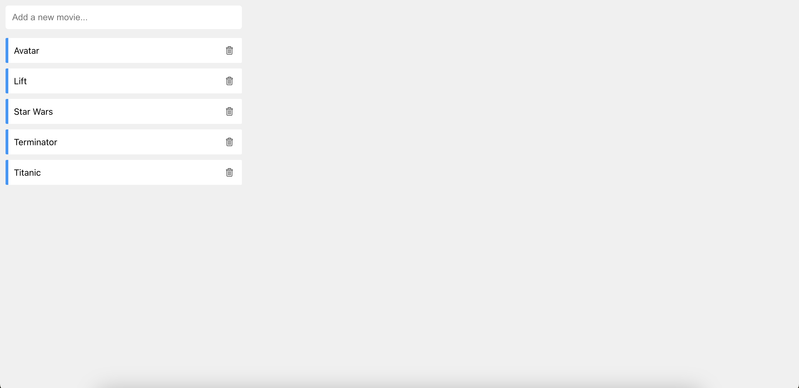
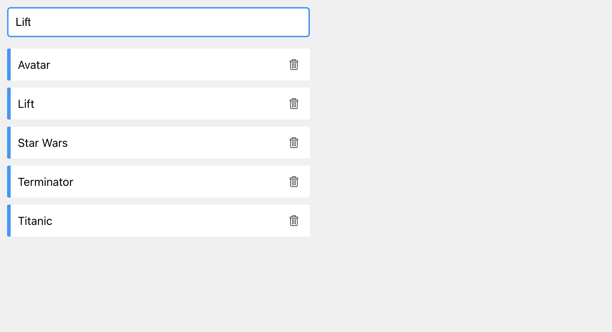
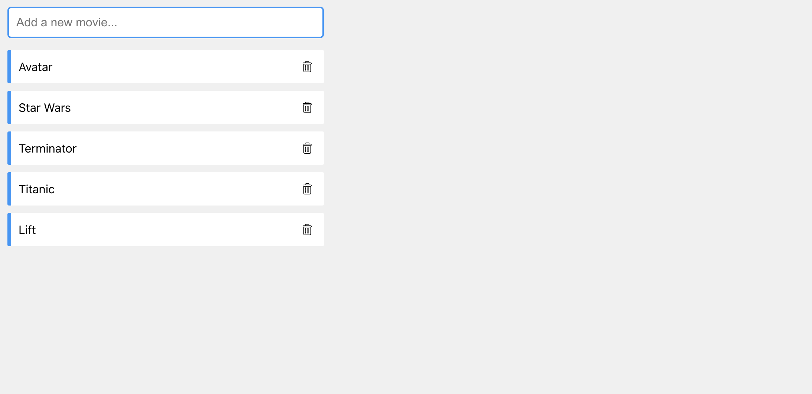

# Docker-Compose || Full-Stack Nodejs Application


## What is Docker Compose

Docker Compose is a tool for defining and running multi-container Docker applications using a YAML file to configure the application's services, networks, and volumes.

## Top 22 commonly used Docker and Docker Compose commands:

- Forcefully remove all running and stopped containers: `docker container rm -f $(docker container ls -aq)`
- Forcefully remove all running and stopped images: `docker image rm -f $(docker image ls -q)`
- List running containers: `docker container ls`
- List all containers (including stopped ones): `docker container ls -a`
- List Docker images: `docker image ls`
- Build an image from a Dockerfile: `docker build -t image_name:tag path/to/Dockerfile`
- Run a container in detached mode: `docker run -d image_name:tag`
- View logs of a running container: `docker logs container_id`
- Stop a running container: `docker stop container_id`
- Remove a container: `docker container rm container_id`
- Remove all stopped containers: `docker container prune`
- Remove an image: `docker image rm image_id`
- Remove all dangling images: `docker image prune`
- Inspect details of a container: `docker inspect container_id`
- Inspect details of an image: `docker image inspect image_id`
- Pull an image from Docker Hub: `docker pull image_name:tag`
- Tag an existing image: `docker tag source_image:tag new_image:tag`
- Push an image to Docker Hub: `docker push image_name:tag`
- Create a Docker network: `docker network create network_name`
- Run a command inside a running container: `docker exec -it container_id command`
- Compose up (start) services defined in a Compose file: `docker-compose up`
- Compose down (stop and remove) services defined in a Compose file: `docker-compose down`

## Project Overview



This project is a full-stack application with a backend and frontend, organized using Docker. The backend, located in the 'backend' directory, consists of an Express.js application with routes, models, middleware, and database configuration. The 'frontend' directory contains a React.js application with components, styles, and service configurations.

> Backend:



Dockerized Node.js and Express.js application.
MongoDB integration with a 'movie' model for data storage.
Middleware for validating IDs.
Database migration configuration and script.
Test suite in the 'tests' directory.

> Frontend:



Dockerized React.js application.
Components for the main app, input forms, and movie list.
Service configuration for API communication.
Public directory with static assets.

> Common:



Docker-compose file for orchestrating backend and frontend containers.
README file for project documentation.
'img' directory with an image file.

## What is a Docker Compose File

A Docker Compose file is a YAML configuration file that defines the services, networks, and volumes of a multi-container Docker application, streamlining the orchestration and configuration of containers. See below:



```
version: "3.8"

services:
  frontend:
    depends_on:
      - backend
    build: ./frontend
    ports:
      - 3000:3000

  backend:
    depends_on:
      - db
    build: ./backend
    ports:
      - 3001:3001
    environment:
      DB_URL: mongodb://db/vidly
    command: ./docker-entrypoint.sh

  db:
    image: mongo:4.0-xenial
    ports:
      - 27017:27017
    volumes:
      - vidly:/data/db

volumes:
  vidly:
```

> > This Docker Compose file defines a multi-container application with frontend, backend, and database services. It uses version 3.8 of the Docker Compose file format and includes the following services:

> > Frontend Service:
> > Depends on the "backend" service.
> > Builds the frontend from the "./frontend" directory.
> > Maps port 3000 on the host to port 3000 in the container.

> > Backend Service:
> > Depends on the "db" service.
> > Builds the backend from the "./backend" directory.
> > Maps port 3001 on the host to port 3001 in the container.
> > Sets the environment variable DB_URL with the MongoDB connection string.
> > Specifies the command to run the ./docker-entrypoint.sh script.

> > Database Service (db):
> > Uses the official MongoDB image version 4.0-xenial.
> > Maps port 27017 on the host to port 27017 in the container.
> > Defines a volume named "vidly" to persist MongoDB data.

> > Volumes:
> > Defines a volume named "vidly" to persist data for the MongoDB container between restarts.
> > This configuration indicates a setup where the frontend communicates with the backend, and the backend uses MongoDB as its database. The "depends_on" ensures that services start in the specified order, with the "db" service starting before the "backend" service.

## What is a Dockerfile

A Dockerfile is a text document containing instructions for building a Docker image, specifying the base image, setting up the environment, copying application code, defining commands, and facilitating the creation of consistent and reproducible containerized applications. See our Backend and Frontend Dockerfile below:

> Backend Dockerfile:



```
FROM node:14.16.0-alpine3.13

# Create app user and group
RUN addgroup app && adduser -S -G app app

# Set the working directory
WORKDIR /app

# Copy package.json and package-lock.json separately to leverage Docker cache
COPY package*.json ./
RUN npm install

# Copy the rest of the application files
COPY . .

# Grant write permissions to the app user for /app directory and the entrypoint script
RUN chown -R app:app /app && chmod +x /app/docker-entrypoint.sh

# Expose the application port
EXPOSE 3001

# Switch to the app user
USER app

# Start the application
CMD ["npm", "start"]
```

> > This Dockerfile utilizes the Node.js Alpine base image, creates a dedicated app user and group, sets up a working directory, copies and installs application dependencies, grants necessary permissions, exposes a port, switches to the app user, and defines the default command to start the Node.js application.

> Frontend Dockerfile:



```
FROM node:14.16.0-alpine3.13

RUN addgroup app && adduser -S -G app app
USER app

WORKDIR /app
COPY package*.json ./
RUN npm install
COPY . .

EXPOSE 3000

CMD ["npm", "start"]
```

> > This Dockerfile starts with the Node.js Alpine base image, creates an "app" user and group, sets the working directory to "/app," copies and installs application dependencies, copies the application code, exposes port 3000, switches to the "app" user, and defines the default command to start the Node.js application.

## Run Our Docker Compose File(i.e Start our Full Stack Nodejs application)

> Step 1: Run thr code below:

```
docker-compose up
```

> Step 2: Visit the site below:

```
http://localhost:3000/
```

and you will see the interface of our application.



> Step 3: You can add more movies to the application database:



